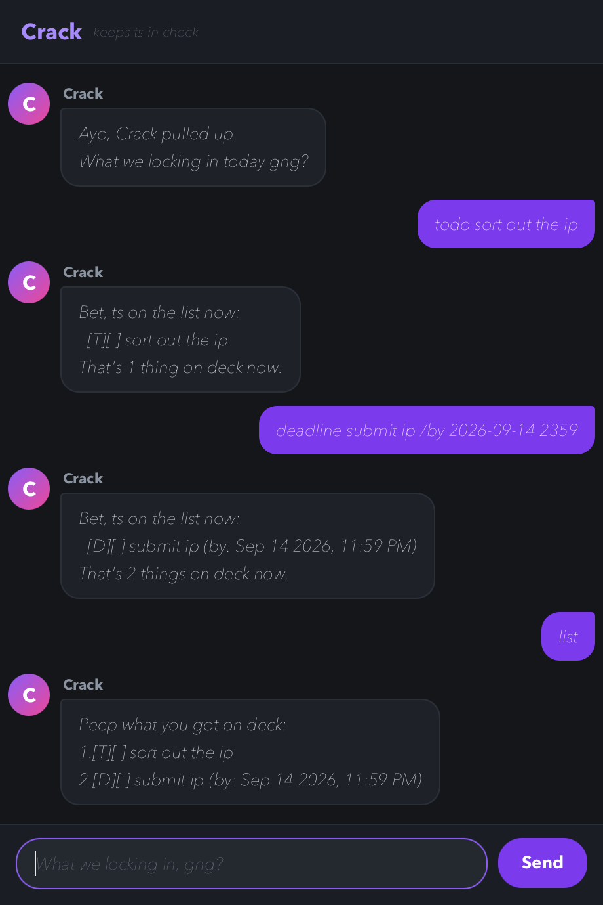

# Crack User Guide



Crack is a task tracker you talk to. Tell it what you have on, in one line,
and it keeps the list for you: things with no date, things due by a date, and
things running between two dates. It saves after every change, so the list is
still there next time you open it.

It talks back in slang. The commands are ordinary words.

## Getting started

1. Make sure you have JDK 25 installed.
2. Download `crack.jar` from the
   [latest release](https://github.com/Alexc09/ip/releases).
3. Put it in the folder you want Crack to work out of, then run it:

   ```
   java -jar crack.jar
   ```

4. Type a command into the box at the bottom and press Enter, or click `Send`.

Not sure what to type? Send `help`.

Building it from source instead? That is what the
[repository README](https://github.com/Alexc09/ip/blob/master/README.md) is for.

## Every command at a glance

| Command | Short forms | Format | What it does |
|---------|-------------|--------|--------------|
| [`todo`](#adding-a-todo) | `t` | `todo <what>` | Adds something with no date |
| [`deadline`](#adding-a-deadline) | `d` | `deadline <what> /by <when>` | Adds something due by a date |
| [`event`](#adding-an-event) | `e` | `event <what> /from <start> /to <end>` | Adds something running between two dates |
| [`list`](#seeing-the-whole-list-list) | `ls` | `list` | Prints everything, numbered |
| [`on`](#seeing-one-day-on) | | `on <when>` | Prints what falls on one day |
| [`find`](#searching-by-word-find) | `f` | `find <word>` | Prints tasks whose description contains a word |
| [`mark`](#marking-a-task-done-mark) | `m` | `mark <number>` | Marks a task done |
| [`unmark`](#putting-a-task-back-unmark) | `um` | `unmark <number>` | Puts a task back on the pile |
| [`delete`](#deleting-a-task-delete) | `rm`, `del` | `delete <number>` | Removes a task for good |
| [`help`](#listing-the-commands-help) | `h`, `?` | `help` | Lists all of this inside the app |
| [`bye`](#leaving-bye) | | `bye` | Closes the window |

Every command takes one line. The rest of this page works through them one at
a time, with the output each one gives back.

## Your first minute

Nothing here is set up in advance, so type these in as they are and you will
have a list worth looking at:

```
todo sort out the ip
deadline submit ip /by 2026-09-14 2359
event tutorial /from 2026-09-15 1000 /to 2026-09-15 1200
list
mark 1
find ip
on 2026-09-15
```

That is three tasks added, the list printed, one of them ticked off, a search
by word and a look at a single day. Between them they cover most of what Crack
does. Your list is already saved; close the window and it comes back.

## Adding a todo

Adds something with no date attached.

Format: `todo <what>`

Example: `todo sort out the ip`

```
Bet, ts on the list now:
  [T][ ] sort out the ip
That's 1 thing on deck now.
```

## Adding a deadline

Adds something due by a date.

Format: `deadline <what> /by <when>`

Example: `deadline submit ip /by 2026-09-14 2359`

```
Bet, ts on the list now:
  [D][ ] submit ip (by: Sep 14 2026, 11:59 PM)
That's 2 things on deck now.
```

## Adding an event

Adds something running from one date to another. The end cannot come before
the start; Crack says so rather than filing it.

Format: `event <what> /from <start> /to <end>`

Example: `event tutorial /from 2026-09-15 1000 /to 2026-09-15 1200`

```
Bet, ts on the list now:
  [E][ ] tutorial (from: Sep 15 2026, 10:00 AM to: Sep 15 2026, 12:00 PM)
That's 3 things on deck now.
```

## Seeing the whole list: `list`

Prints everything, numbered. Those numbers are what `mark`, `unmark` and
`delete` take.

Format: `list`

```
Peep what you got on deck:
1.[T][ ] sort out the ip
2.[D][ ] submit ip (by: Sep 14 2026, 11:59 PM)
3.[E][ ] tutorial (from: Sep 15 2026, 10:00 AM to: Sep 15 2026, 12:00 PM)
```

`[T]`, `[D]` and `[E]` say which kind of task it is. `[X]` means done.

## Marking a task done: `mark`

Format: `mark <number>`

Example: `mark 1`

```
Ayo that's a W. Ts done:
  [T][X] sort out the ip
```

## Putting a task back: `unmark`

The other direction, for when you marked something too early.

Format: `unmark <number>`

Example: `unmark 1`

```
Aight, ts back on the pile:
  [T][ ] sort out the ip
```

## Deleting a task: `delete`

Drops a task for good. There is no undo, so check the number first.

Format: `delete <number>`

Example: `delete 3`

```
Say less, ts gone:
  [E][ ] tutorial (from: Sep 15 2026, 10:00 AM to: Sep 15 2026, 12:00 PM)
That's 2 things on deck now.
```

## Searching by word: `find`

Prints every task whose description contains the word. Matching is case
sensitive, so `ip` and `IP` are different searches.

Format: `find <word>`

Example: `find ip`

```
Aight, peep what I dug up:
1.[T][ ] sort out the ip
2.[D][ ] submit ip (by: Sep 14 2026, 11:59 PM)
```

The numbers here count the matches, not the whole list. Run `list` before you
mark or delete anything.

## Seeing one day: `on`

Prints the deadlines due that day and the events running over it, including
events that started earlier and have not finished.

Format: `on <when>`

Example: `on 2026-09-15`

```
Here's what's cooking on Sep 15 2026:
  [E][ ] tutorial (from: Sep 15 2026, 10:00 AM to: Sep 15 2026, 12:00 PM)
```

## Listing the commands: `help`

Prints every command, its short forms and what it does.

Format: `help`

```
Aight, here's the whole playbook:
  todo <what> (t) - ts with no date
  deadline <what> /by <when> (d) - ts with a due date
  event <what> /from <start> /to <end> (e) - ts spanning two dates
  list (ls) - everything you got on deck
  on <when> - what lands on one day
  find <word> (f) - hunt ts down by description
  mark <num> (m) - call ts done
  unmark <num> (um) - put ts back on the pile
  delete <num> (rm, del) - drop ts off the list
  help (h, ?) - this right here
  bye - I fade
Dates go 2/12/2020 1500 or 2019-10-15. Time's optional.
```

## Leaving: `bye`

Format: `bye`

```
Aight bet, I'm finna fade. Don't get cooked.
```

The window closes itself a moment later. Everything is already saved.

## Dates

Anywhere a command takes a date, any of these shapes work. The time is
optional, and is written as four digits on a 24 hour clock.

```
2/12/2020 1500
2/12/2020
2020-12-02 1500
2020-12-02
```

Crack reads them back as `Dec 2 2020` and `Dec 2 2020, 3:00 PM`. A date that
does not exist, such as `30/2/2026`, is refused rather than quietly moved to
the end of the month.

## When something goes wrong

Crack says what it did not understand and leaves the list alone.

```
blah
  Icl I got no clue what ts means. Type help.

todo
  Nah, a todo needs an actual description gng.

deadline pay fees
  Yo, a deadline needs a '/by'. Like: deadline return book /by 2/12/2020 1500

mark 9
  You only got 2 tasks, so 9 ain't it.
```

## Where your tasks are kept

Crack writes to `data/data.txt`, next to wherever you launched it from, and
reads it back on startup. Launch from the same folder each time and you will
see the same list.

The file is plain text and you can edit it, though there is no need to. If a
line in it stops making sense, Crack skips that line and keeps the rest rather
than losing everything.
